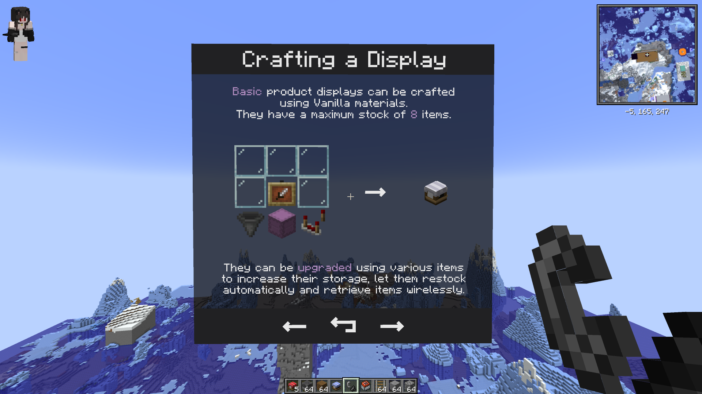
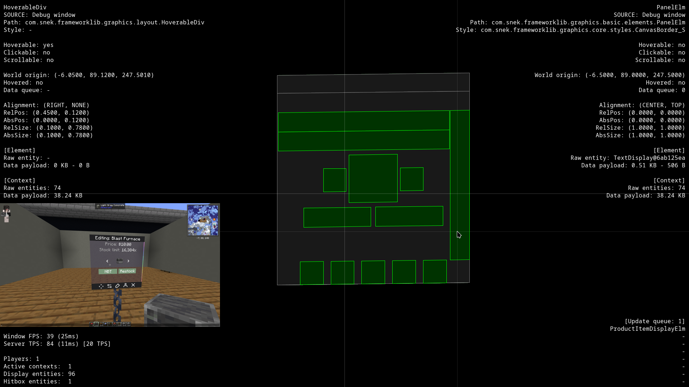

# FrameworkLib

A fully server-side graphics & utility library for Fabric.

FrameworkLib adds a variety of classes to aid mod development for Minecraft 1.20.1.
These include display entity based graphics, generic utility methods and data types, debugging utilities, custom recipes, and input detection.

The library is purely server-side and doesn't require any additional resourcepack, mod, or setting on the client side.
This makes it compatible with all clients and most mods and modpacks.
//TODO add images

## Features

### Graphics

- UI graphic contexts for in-world multiplayer menus
- HUD graphic contexts for per-player movable menus
- Ready-made graphic elements (Divs, Flexes, Panels, Text elements, Item displays, Lists, Buttons, etc...)
- Click, hover, scroll and chat message detection
- Element styles and Animations
- Support for custom graphic elements and styles
- Multiline elements and premade icons
- Bitmap displays //TODO
- 

### Utilities

- A server-wide Scheduler and task handlers
- A handy Txt class built on top of Minecraft's Component
- Generic utility methods (Size/Time/Price/Amount formatters, Color handling, Interpolations, etc...)
- Minecraft-related utility methods (Custom head generator, ItemStack serialization, ItemStack name retrieval, etc...)
- Network-related utility methods (Packet sender, payload size calculation, etc...)
- Containers (Pair, Triplet, Option, Result, Flagged, etc...)
- Transforms, Easings
- Command stack trace logger
- Interaction and Display accessors

### Debugging

- Debug mode detection
- Inspector window for graphic elements
- Precondition checks
- 

### Misc

- Custom recipes with support for item Count, NBTs, and runtime stack creation
- Easily accessible player data cache (skins, names)

//TODO add examples
//TODO add images